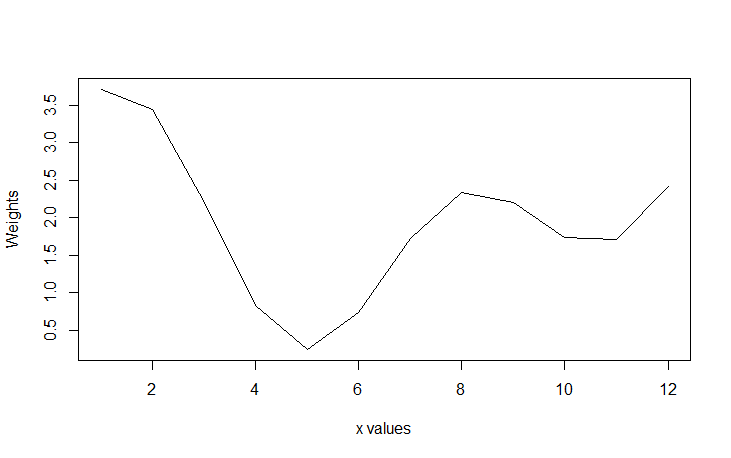

---
title: 'A Parametric Method for Generating Synthetic Data'
tags:
  - R
  - synthetic data generator
  - dummy data generator
  - fake data generator

authors:
  - name: Sidharth Macherla
    orcid: 0000-0002-4825-2026
    affiliation: 1

affiliations:
 - name: Sidharth Macherla, Researcher
   index: 1

date: 22 January 2020

bibliography: paper.bib
---

# Summary
Data science applications need data to prototype and demonstrate to potential clients. For such purposes, using production data is a possibility. However, it is not always feasible due to legal and/or ethical considerations[@SynDataNeed]. This resulted in a need for generating synthetic data. This need is the key motivator for this paper.

Data across multiple industry domains such as Commerce [@10.2307/1884282],  Food industry[@doi:10.1177/1847979018808673] are known to exhibit some form of seasonality, cyclicality, and trend. Although there are synthetic data generation packages such as synthpop[@synthpop] in R and sklearn.datasets [@scikit-learn] in Python, they focus primarily on synthetic versions of microdata containing confidential information or for machine learning purposes. There is a need for a more generic synthetic data generation package that helps for multiple purposes.

In summary, this paper approaches synthetic data generation in a stepwise approach. Firstly, data distribution is generated using a parametric methodology. This data distribution is assigned months and days to finally generate a year's worth of data. Secondly, seasonality, cyclicality and trend are attributed to this data distribution. Finally, the data is assigned customer, product and corresponding product price information. The following sections of this paper detail the methodology that drives the approach to build synthetic data.

# Methodology
##  Parametric Methodology:
This paper presents a parametric method for building synthetic data and is embedded in the function **buildDistr()**.  The formulation behind this function is as follows.
\begin{equation}
\label{eq:1}
\sin(a \cdot x) + \cos(b \cdot x) + c
\end{equation} 
$$\begin{array}{l}
\textrm{where,}\cr
\textrm{$a$, $b$ are parameters}\cr
\textrm{$x$ is a variable}\cr
\textrm{$c$ is a constant}\cr
\end{array}$$

This formulation produces a wave-like distribution with $x$ values on the x-axis and weights as the y-axis. The parameters $a$ and $b$ define the number of crests in the distribution and are supplied to the function as arguments. The parameter $c$ acts as an intercept. Since data from this distribution are used as weights to compute the number of transactions, it is required that they are positive values. Parameter $c$ helps in ensuring that these values are positive. The following example illustrates the data distribution based on this formulation.

Let $x = \{\imath \in \mathrm{R} \mid 0< x \leq12\}$. Let us also assume that $a$ = 2, $b$ = 1 and $c$ = 2. Substituting these parameters in equation(\ref{eq:1}) gives the following data distribution.
\begin{equation}
\label{eq:2}
\sin(1 \cdot x) + \cos(0.5 \cdot x) + 2
\end{equation}
Visually, this equation can be plotted as given below.

##  Steps to generate variable x:
Using this parametric methodology, data are generated at two levels namely, month level and day level.

### Step 1: Month level
Initially, 12 data points are generated . These are then assigned a month number i.e. 1 to 12 representing months in an year. These data constitute $x$.
    $$ m = \{ January, February, ..., December\}$$
\begin{equation}
\label{eq:3}
x = \{x_m \in \mathrm{R} \mid 0 < x_m \leq 12\}
\end{equation}
    $$x \mapsto m$$

These data points are used to generate a set of weights $W$ for the year computed based on the equation(\ref{eq:1}).
\begin{equation}
\label{eq:4}
W = \{\sin(a \cdot x) + \cos(b \cdot x) + c \}
\end{equation}

Additionally, these weights in equation(\ref{eq:4}) are normalized to conform to the following.
\begin{equation}
\label{eq:5}
\sum(W) = T
\end{equation}
$$\begin{array}{l}
\textrm{Where, }\cr
\textrm{$T$ is total number of rows in final synthetic data set}
\end{array}$$

### Step 2: Day level
In this step, weights are generated for each day of the month in the following manner.

\begin{equation}
\label{eq:6}
y_m = \{ y_{mi} \in \mathrm{R} \mid 0 < y_{mi} \leq d_m \}
\end{equation}
$$\begin{array}{l}
\textrm{where,}\cr
\textrm{$y_m$ is set of weights for all days of month $m$}\cr
\textrm{$y_{mi}$ is day $i$ of month $m$}\cr
\textrm{$d_m$ is number of days in month $m$}\cr
\end{array}$$

Let $W_m^d$ be set of weights for all days in the month $m$. Then,
\begin{equation}
\label{eq:7}
W_m^d = \{\sin(a \cdot y_m) + \cos(b \cdot y_m + c \}
\end{equation}

From equation(\ref{eq:4}), it is known that $W$ is the set of weights for all the months of a year. Let us assume that $w_m$ be the weight of a month and $w_m \in W$. The set of weights $W_m^d$ in equation(\ref{eq:7}) above are normalized to conform to the following.
\begin{equation}
\label{eq:8}
\sum(W_m^d) = w_m
\end{equation}

$$\begin{array}{l}
\textrm{Where, }\cr
\textrm{$w_m$ is the weight of the month $m$}\cr
\textrm{$W_m^d$ is set of weights for all days in the month $m$}
\end{array}$$

# References