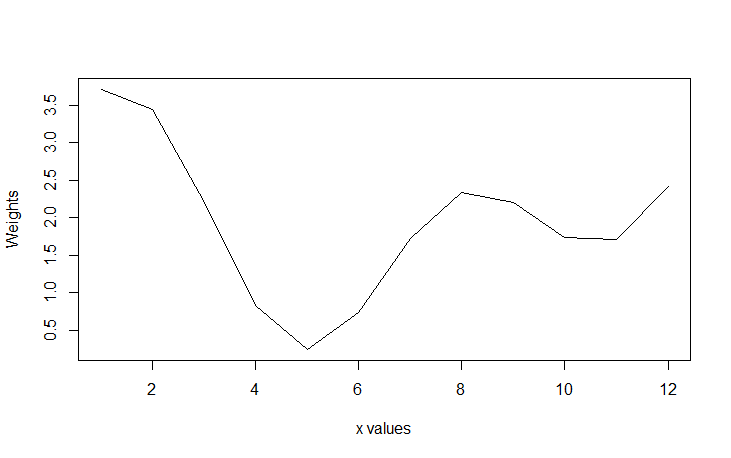

---
title: 'A Parametric Method for Generating Synthetic Data'
tags:
  - R
  - synthetic data generator
  - dummy data generator
  - fake data generator

authors:
  - name: Sidharth Macherla
    orcid: 0000-0002-4825-2026    
authors:
  - name: Sidharth Macherla
    orcid: 0000-0002-4825-2026
    affiliation: 1
affiliations:
 - name: Sidharth Macherla, Data Scientist
   index: 1
    
date: 12 January 2020

bibliography: paper.bib
---

# Summary
Data science applications need data to prototype and demonstrate to potential clients. For such purposes, using production data is a possibility. However, it is not always feasible due to legal and/or ethical considerations[@SynDataNeed]. This resulted in a need for generating synthetic data. This need is the key motivator for the package **conjurer**.

Data across multiple industry domains such as Commerce [@10.2307/1884282],  Food industry[@doi:10.1177/1847979018808673] are known to exhibit some form of seasonality, cyclicality and trend. Although there are synthetic data generation packages such as synthpop[@synthpop] in R and sklearn.datasets [@scikit-learn] in Python, they focus on synthetic versions of microdata containing confidential information or for machine learning purposes. There is a need for a more generic synthetic data generation package that helps for multiple purposes such as forecasting, customer segmentation, insight generation etc. This package **conjurer** helps in generating such synthetic data.

# Methodology
Methodology\\
Methodology\\
Parametric Methodology:\\
This paper presents a parametric method to building synthetic data. This methodology is embedded in the function **buildDistr()** and is called multiple times during the data generation process. The formulation behind this function is as follows.
\begin{equation}
\label{eq:1}
\sin(a \cdot x) + \cos(b \cdot x) + c
\end{equation} 
$$\begin{array}{l}
\textrm{where:}\cr
\textrm{$a$, $b$ are parameters}\cr
\textrm{$x$ is a variable}\cr
\textrm{$c$ is a constant}\cr
\end{array}$$

This formulation produces a wave like distribution with $x$ values on x-axis and weights as y-axis. The parameters $a$ and $b$ define the number of crests in the distribution while parameter $c$ acts as an intercept. Since data from this distribution are used as weights to compute the number of transactions, it is required that they are positive values. Parameter $c$ helps in ensuring that these values are positive. The following example illustrates the data distribution based on this formulation.\\

Let $x = \{\imath \in \mathrm{R} \mid 0< x \leq12\}$. Let us also assume that $a$ = 2, $b$ = 1 and $c$ = 2. Substituting these parameters in equation(\ref{eq:1}) gives the following data distribution.\\
\begin{equation}
\label{eq:2}
\sin(1 \cdot x) + \cos(0.5 \cdot x) + 2
\end{equation}
Visually, this equation can be plotted as given below.\\
 \\

Steps to generating data:\\
Using this parametric methodology, data are generated in a step wise approach. Let us assume that the seasonality of the data is quarterly.
Step 1:\\
Initially, 12 data points are generated . These are then assigned a month number i.e. 1 to 12 representing months in an year. These data constitute x.
    $$ m = \{ January, February, ..., December\}$$
    $$x = \{\imath \in \mathrm{R} \mid 0 < \imath \leq 12\}$$
    $$x \mapsto m$$

Step 2:\\
When the $x$ values range from 1 to 12, the following combinations of parameter $a$ and $b$ values generate crests as given in the table below.

|Parameter $a$|Parameter $b$|No: of crests|
|:-----------------:|:---------------:|:---------------:|
|1 |0.5|2|
|2 |1|4|
|4 |2|12|

# References